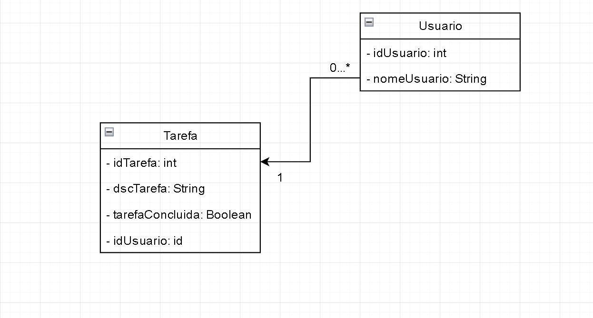

# Aplicativo To Do List
Esse é um aplicativo em desenvolvimento para conseguir listar quais tarefas um usuário precisa fazer, quais já estão realizadas

# Diagrama UML 
## Versão 1.0

# Versionamento
Versionamento está sendo feito pelo GitLab, criando issues para conseguir entender melhor o fluxo e prioridade de cada atividade

